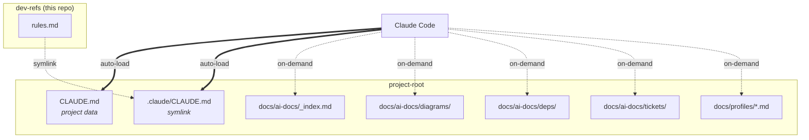
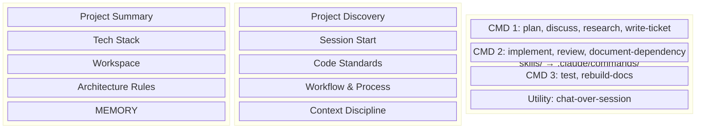
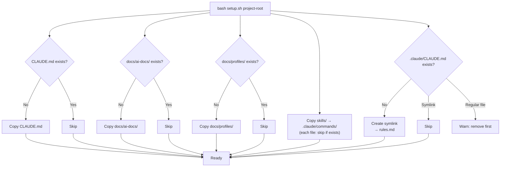

# dev-refs

Personal archive for development guidelines and CLI workspace contexts.

---

## AI Rules — Drop-in Project Kit

A universal project rules kit for Claude Code.
Rules and project data are **separated** — update rules once, all linked projects get the change.

---

## Structure

```
dev-refs/                          (this repo)
├── CLAUDE.md                      ← Project data template
├── rules.md                       ← Universal rules (symlinked into projects)
├── setup.sh                       ← One-command deploy script
├── skills/                        ← Slash command skills (copied into projects)
│   ├── plan.md                    CMD 1 — Planner
│   ├── discuss.md                 CMD 1 — Planner
│   ├── research.md                CMD 1 — Planner
│   ├── write-ticket.md            CMD 1 — Planner
│   ├── implement.md               CMD 2 — Coder
│   ├── review.md                  CMD 2 — Coder
│   ├── document-dependency.md     CMD 2 — Coder
│   ├── test.md                    CMD 3 — Tester
│   ├── rebuild-docs.md            CMD 3 — Tester
│   └── chat-over-session.md       (cross-CMD utility)
└── docs/
    ├── ai-docs/                   ← Project state/diagrams/tickets store
    │   ├── _index.md
    │   ├── diagrams/
    │   ├── deps/
    │   └── tickets/{idea,todo,wip,done,dropped}/
    └── profiles/                  ← Stack-specific rules
        ├── cpp-mfc.md
        ├── cpp-imgui.md
        └── cpp-opencv.md
```

## Setup

### 0. Prerequisites (per public project)

Set a safe git email to prevent company/personal email exposure in public repos.
Do NOT use `--global` if you also use a company GitLab — set per project instead:

```bash
cd <project-root>
git config user.email "<your-github-username>@users.noreply.github.com"
```

Also add these to your project's `.gitignore`:

```
.env
.env.*
*.key
*.pem
credentials.json
secrets.json
```

### 1. Deploy to a project

```bash
bash /path/to/dev-refs/setup.sh <project-root>
```

This will:
- Copy `CLAUDE.md` (skips if already exists)
- Copy `docs/ai-docs/` and `docs/profiles/`
- Create ticket directories (`idea/`, `todo/`, `wip/`, `done/`, `dropped/`)
- Copy `skills/` → `.claude/commands/` (each file skipped if already exists)
- Symlink `rules.md` → `<project>/.claude/CLAUDE.md`

Result in project:
```
project-root/
├── CLAUDE.md              ← Project data (Summary, Tech Stack, MEMORY)
├── .claude/
│   ├── CLAUDE.md          → symlink to dev-refs/rules.md
│   └── commands/          ← Skills (/plan, /implement, ...)
└── docs/
    ├── ai-docs/
    │   ├── _index.md
    │   ├── diagrams/
    │   ├── deps/
    │   └── tickets/
    └── profiles/
```

Claude Code auto-loads both `CLAUDE.md` and `.claude/CLAUDE.md`, so rules
and project data are both available every session.

### 2. Update dev-refs

```bash
cd /path/to/dev-refs && git pull
```

Symlinked `rules.md` updates automatically in all linked projects.

> **Note:** If `git pull` fails with `fatal: refusing to merge unrelated histories`,
> delete and re-clone:
> ```bash
> rm -rf /path/to/dev-refs
> git clone https://github.com/Jongheon-Park/dev-refs.git /path/to/dev-refs
> ```

### 3. Scenarios

#### A) New project

1. Run `setup.sh`
2. On the first session, the AI asks "Shall I run project discovery?"
3. On confirmation, Discovery runs automatically

#### B) Existing project (no AI rules)

Same as A. Analyzes and documents existing source code.

#### C) Existing project (with Copilot rules)

1. Run `setup.sh` (alongside existing `0.AI_CORE.md`, etc.)
2. AI auto-detects existing files and asks to migrate
3. On confirmation: extracts data → new structure → old files → `docs/_legacy/`

#### D) Existing project (with Copilot + Claude rules)

1. Run `setup.sh` (CLAUDE.md is skipped since it already exists)
2. Manually remove the rules section from existing `CLAUDE.md` — keep project data + MEMORY only
3. Rules are now served by the symlinked `.claude/CLAUDE.md`

---

## Skills

Markdown files in `skills/` are copied to `.claude/commands/` on deployment.
Run with `/command-name` in Claude Code.

### CMD 1 — Planner

Documents only. No source code changes allowed.

| Command | Description |
|:---|:---|
| `/plan <feature>` | Research → design → save ticket. No code changes. Verified by subagent. |
| `/discuss <topic>` | Open brainstorming. No file changes. Challenge assumptions. |
| `/research <question>` | Anti-hallucination analysis. No source → delete. Unknown → "I don't know." |
| `/write-ticket <topic>` | Create/edit tickets. `idea/`→`todo/`→`wip/`→`done/` |

### CMD 2 — Coder

Read documents, write code. Cannot start without a ticket.

| Command | Description |
|:---|:---|
| `/implement <ticket>` | Ticket required. Verify plan → code → security check → commit + report. |
| `/review <target>` | Code review. Critical/Important/Minor classification. Saves report. |
| `/document-dependency <pkg>` | Document external library API against actual source. |

### CMD 3 — Tester

Run tests only. No code changes. Deliver results as reports to CMD 2.

| Command | Description |
|:---|:---|
| `/test <ticket-stem>` | Build + test → write test report. No code changes. |
| `/rebuild-docs` | Regenerate `_index.md` and `mental-model/` from current source. |

### Utility

| Command | Description |
|:---|:---|
| `/chat-over-session <name>` | File-based messaging between two Claude Code sessions. |

### Three-CMD Workflow

```
[CMD 1 — Planner]              [CMD 2 — Coder]              [CMD 3 — Tester]
/plan, /discuss,               /implement, /review,          /test, /rebuild-docs
/research, /write-ticket       /document-dependency

  ↓ ticket (plan)               ↑ reads ticket                ↑ reads code
       docs/ai-docs/tickets/ ──→ implements ──→ code ────────→ runs tests
                                 ↑                              ↓
                                 └──── reads test report ───────┘
                                       (docs/ai-docs/tickets/)
```

**Communication:** All CMDs share `docs/ai-docs/tickets/`. Plans flow CMD 1→2. Test reports flow CMD 3→2.

---

## Diagrams

### File Relationship

How Claude Code loads files at runtime:



### File Contents

What each file is responsible for:



### Deploy Flow

What `setup.sh` does:



---

## Recording System — 3 Layers

Project knowledge is managed in 3 layers.

```
docs/ai-docs/
├── _index.md          ← Layer 1: Architecture (rarely changes)
├── _memory.md         ← Layer 2: Session memory (updated each session)
├── mental-model/      ← Layer 3: Operational knowledge (updated after code changes)
├── deps/              ← External API facts
├── tickets/           ← Work records and reports
└── diagrams/          ← Architecture diagrams
```

| Layer | File | When updated | Content |
|:---|:---|:---|:---|
| 1 | `_index.md` | Architecture changes | Module map, build config, tech stack |
| 2 | `_memory.md` | Every session start/end | Recent work, pending items, ephemeral notes |
| 3 | `mental-model/*.md` | After code changes | Contracts, coupling, extension points, gotchas |

### Document Production Map

| Document Type | Filename Pattern | Location | Producer | Consumer |
|:---|:---|:---|:---|:---|
| Ticket (plan) | `YYMMDD-<cat>-<name>.md` | `tickets/<status>/` | CMD 1 | CMD 2 |
| Test Report | `YYMMDD-test-report-<stem>.md` | `tickets/wip/` | CMD 3 | CMD 2 |
| Review Report | `YYMMDD-review-report-<stem>.md` | `tickets/wip/` | CMD 2 | CMD 2 |
| Research Report | `YYMMDD-research-<topic>.md` | `tickets/wip/` | CMD 1 | CMD 1, 2 |
| Completion Report | `### Result` in ticket | Existing ticket | CMD 2 | All |
| Dependency Doc | `<pkg>[v<ver>].md` | `deps/` | CMD 2 | CMD 2 |
| Project Doc | `_index.md` + `diagrams/` | `ai-docs/` | CMD 3 | All |
| Session Memory | `_memory.md` | `ai-docs/` | CMD 2 | All |
| Operational Knowledge | `<domain>.md` | `mental-model/` | CMD 3 | All |

## File Roles

| File | Loaded when | Role |
|:---|:---|:---|
| `CLAUDE.md` | **Auto** (every session) | Project data, Architecture Rules, MEMORY |
| `.claude/CLAUDE.md` | **Auto** (every session) | Universal rules (symlink → `rules.md`) |
| `.claude/commands/*.md` | On `/command` execution | Slash command skills |
| `docs/ai-docs/_index.md` | Architecture context needed | Project state, architecture, directory map |
| `docs/ai-docs/_memory.md` | **Session start** | Recent work, pending items, ephemeral notes |
| `docs/ai-docs/mental-model/*.md` | Modifying that domain | Contracts, coupling, gotchas |
| `docs/ai-docs/diagrams/*.md` | Architecture analysis | Mermaid diagrams |
| `docs/ai-docs/deps/*.md` | Using that package | Verified API facts |
| `docs/ai-docs/tickets/*.md` | Working on that task | Tickets, test/review/research reports |
| `docs/profiles/*.md` | Discovery + stack-specific tasks | Stack-specific rules (auto-generated if missing) |

## Token Efficiency

- `CLAUDE.md` + `.claude/CLAUDE.md` stay in context — everything else loads on demand
- **Session start**: `git log --oneline -10` + `_memory.md` to catch up.
  `_index.md` loaded only when architecture context is needed
- **After each task**: No doc updates. Commit messages serve as the devlog
- **MEMORY**: Updated only at session end or on user request
- **Rules separated**: `rules.md` changes propagate via symlink, no per-project edits

## docs/_legacy/

Previous versions of rule files (0.AI_CORE.md, refs/, etc.).
Automatically moved after migration. Kept for reference. Do not copy to new projects.

---

**Last Updated:** 2026-03-26
