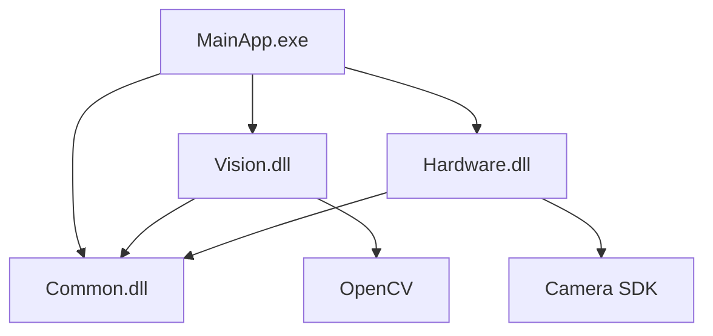

# AI_ARCHITECTURE.md

## 1. SYSTEM OVERVIEW
- **Project Name**: [TBD - To be filled during project discovery]
- **Target Platform**: Windows (MFC / Visual C++ / C#)
- **Development Environment**: Visual Studio [Version TBD]
- **Primary Goal**: [One-line summary of system purpose - TBD]
- **Solution File**: [Path to .sln file - TBD]

---

## 2. LAYERED ARCHITECTURE

### Layer Hierarchy
```
┌─────────────────────────────────────────┐
│     PRESENTATION LAYER                  │
│  (Main EXE, UI Dialogs, MFC View/Doc)  │
└─────────────┬───────────────────────────┘
              │
┌─────────────▼───────────────────────────┐
│    BUSINESS/LOGIC LAYER                 │
│  (Vision Processing, Inspection Logic)  │
└─────────────┬───────────────────────────┘
              │
┌─────────────▼───────────────────────────┐
│   HARDWARE INTERFACE LAYER              │
│ (Camera Drivers, PLC, Motion Control)   │
└─────────────┬───────────────────────────┘
              │
┌─────────────▼───────────────────────────┐
│      DATA/COMMON LAYER                  │
│ (Common DLLs, Utilities, Config Files)  │
└─────────────────────────────────────────┘
```

### Layer Responsibilities
| Layer | Components | Responsibilities | Threading |
| :--- | :--- | :--- | :--- |
| **Presentation** | `*.exe`, `*Dlg.cpp`, `*View.cpp` | User Interface, Input Handling, Display Updates | Main UI Thread |
| **Business/Logic** | `*Processor.cpp`, `*Service.dll` | Core Algorithms, Inspection Logic, Data Processing | Worker Threads |
| **Hardware Interface** | `*Driver.dll`, `*Comm.cpp` | Device Communication, HW Abstraction | Polling Threads |
| **Data/Common** | `Common.dll`, `*Util.cpp` | Shared Utilities, Data Structures, Config Management | Any Thread |

---

## 3. CORE MODULES & LIBRARIES

### Module Inventory
| Module Name | Type | Description | Dependencies | Location |
| :--- | :--- | :--- | :--- | :--- |
| [MainApp.exe] | Executable | Main Application UI | [Common.dll, Vision.dll] | /src/MainApp |
| [Vision.dll] | Library | Core Vision Algorithm | OpenCV, NI Vision | /src/Vision |
| [Common.dll] | Library | Shared Utilities & Types | None | /src/Common |
| [Hardware.dll] | Library | HW Interface & Drivers | Vendor SDKs | /src/Hardware |

### Dependency Graph


---

## 4. DATA FLOW & THREADING MODEL

### Thread Architecture
```
Main UI Thread (ID: 1)
├── Window Message Loop
├── User Input Handling
└── UI Update Coordination
    │
    ├─► Worker Thread 1: Vision Processing
    │   ├── Image Acquisition
    │   ├── Algorithm Execution
    │   └── PostMessage(WM_VISION_COMPLETE)
    │
    ├─► Worker Thread 2: File I/O
    │   ├── Data Loading/Saving
    │   └── PostMessage(WM_FILE_COMPLETE)
    │
    └─► Worker Thread 3: Hardware Polling
        ├── Device Status Check
        └── PostMessage(WM_HW_STATUS)
```

### Thread Communication Rules
| From | To | Method | Purpose |
| :--- | :--- | :--- | :--- |
| Worker Thread | Main UI Thread | `PostMessage()` | Async UI update (Non-blocking) |
| Main UI Thread | Worker Thread | Event/Flag | Start/Stop signal |
| Worker Thread | Worker Thread | Mutex + Shared Buffer | Data exchange |

### Synchronization Primitives
- **UI Access**: Strictly Main Thread only
- **Shared Data**: Protected by `CCriticalSection` or `std::mutex`
- **Thread-Safe Queues**: For producer-consumer patterns
- **Event Objects**: For thread signaling

---

## 5. EXTERNAL DEPENDENCIES

### Third-Party SDKs
| SDK Name | Version | Purpose | License |
| :--- | :--- | :--- | :--- |
| OpenCV | [TBD] | Image Processing | BSD |
| NI Vision | [TBD] | Industrial Vision Tools | Commercial |
| [Camera SDK] | [TBD] | Camera Interface | Commercial |
| [Motion SDK] | [TBD] | Motion Control | Commercial |

### Hardware Interfaces
| Device Type | Model | Interface | Driver Location |
| :--- | :--- | :--- | :--- |
| Industrial Camera | [TBD] | GigE Vision / USB3 | /libs/CameraSDK |
| Motion Controller | [TBD] | RS-232 / Ethernet | /libs/MotionSDK |
| PLC | [TBD] | Modbus / EtherCAT | /libs/PLCSDK |

### Development Environment
- **IDE**: Visual Studio [Version TBD]
- **Compiler**: MSVC [Version TBD]
- **Framework**: .NET Framework [Version TBD] (if applicable)
- **Build System**: MSBuild
- **Version Control**: [TBD - Git/SVN/None]

---

## 6. CONFIGURATION & DATA FILES

### Configuration Files
| File | Location | Format | Purpose |
| :--- | :--- | :--- | :--- |
| `config.ini` | `/bin/Config` | INI | Application settings |
| `vision.xml` | `/bin/Config` | XML | Vision algorithm parameters |
| `calibration.dat` | `/bin/Data` | Binary | Camera calibration data |

### Runtime Data Paths
- **Log Files**: `/bin/Logs`
- **Image Storage**: `/bin/Images`
- **Recipe Files**: `/bin/Recipes`
- **Backup Files**: `/bin/Backup`

---

## 7. BUILD CONFIGURATION

### Build Targets
| Configuration | Platform | Output Path | Optimization |
| :--- | :--- | :--- | :--- |
| Debug | x86 | /bin/Debug/x86 | Off, Debug Info |
| Debug | x64 | /bin/Debug/x64 | Off, Debug Info |
| Release | x86 | /bin/Release/x86 | Full, No Debug Info |
| Release | x64 | /bin/Release/x64 | Full, No Debug Info |

### Preprocessor Definitions
- Debug: `_DEBUG`, `_CONSOLE`, `_UNICODE`
- Release: `NDEBUG`, `_CONSOLE`, `_UNICODE`

---

## 8. MAINTENANCE & VERSIONING

### Version Numbering
Format: `MAJOR.MINOR.PATCH.BUILD`
- **MAJOR**: Breaking changes
- **MINOR**: New features (backward compatible)
- **PATCH**: Bug fixes
- **BUILD**: Auto-incremented build number

### Change Log Location
- `/docs/CHANGELOG.md` (Human-readable)
- `AI_DEVLOG.md` (AI development log)

---

## 9. PERFORMANCE CONSIDERATIONS

### Critical Performance Paths
| Operation | Target Time | Current Time | Notes |
| :--- | :--- | :--- | :--- |
| Image Acquisition | < 50ms | [TBD] | Camera capture + transfer |
| Vision Processing | < 200ms | [TBD] | Full inspection cycle |
| UI Refresh | < 16ms (60fps) | [TBD] | Display update |
| File I/O | < 100ms | [TBD] | Save/Load recipe |

### Optimization Strategies
- Multi-threading for parallel processing
- GPU acceleration (if available)
- Memory pooling for frequent allocations
- Lazy loading for large datasets

---

## 10. SECURITY & ACCESS CONTROL

### User Roles
| Role | Access Level | Capabilities |
| :--- | :--- | :--- |
| Operator | Read-Only | Run inspection, view results |
| Engineer | Read-Write | Modify recipes, calibrate |
| Admin | Full Control | System configuration, user management |

---

**[TO BE UPDATED DURING PROJECT DISCOVERY AND ONGOING DEVELOPMENT]**
