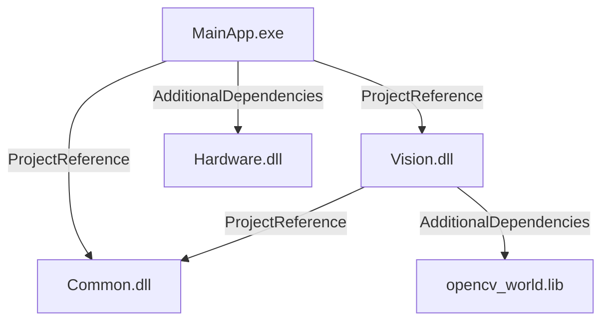
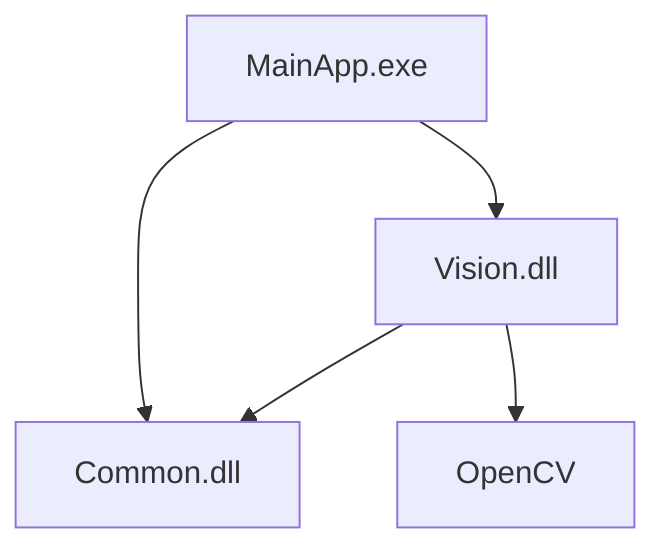
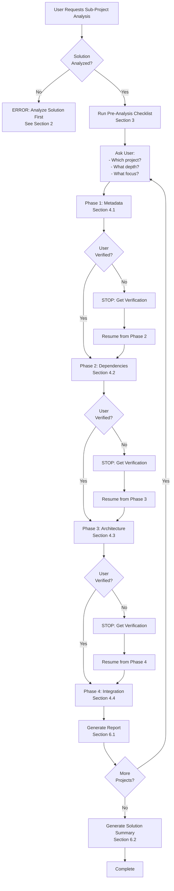

# AI_LARGE_SOLUTION_STRATEGY.md

## PURPOSE
Comprehensive strategy guide for analyzing large-scale Visual Studio solutions with multiple projects, DLLs, and complex dependencies. This document provides detailed workflows, templates, and best practices to ensure systematic and evidence-based analysis.

---

## 1. DOCUMENT SCOPE

### When to Use This Document
- Solution contains **3+ projects** (EXE + multiple DLLs)
- Sub-project analysis requested
- Dependency mapping required
- Architecture documentation needed

### Related Documents
- **AI_WORK_RULES.md** (Section 1.5): Quick reference checklist
- **AI_VERIFICATION_PROTOCOL.md**: Evidence standards
- **AI_ANALYSIS_LEVELS.md**: Function-level analysis depth
- **AI_ARCHITECTURE.md**: System architecture template

---

## 2. ANALYSIS LEVELS HIERARCHY

```
Level 0: SOLUTION OVERVIEW
├── Solution file (.sln) structure
├── Project inventory (count, types)
└── High-level dependency graph

Level 1: PROJECT INVENTORY
├── Project metadata (.vcxproj)
├── Output types (EXE/DLL/LIB)
└── Primary dependencies

Level 2: DEPENDENCY MAPPING
├── ProjectReference analysis
├── Include directories
└── Library linkages

Level 3: MODULE ARCHITECTURE
├── Key classes per project
├── Public interfaces
└── Threading model

Level 4: DETAILED CODE ANALYSIS
├── Function-level analysis
├── Call chain tracing
└── Implementation details
```

---

## 3. MANDATORY PRE-ANALYSIS CHECKLIST

### Before Starting Any Sub-Project Analysis

```markdown
## Pre-Analysis Verification (MANDATORY)

### Step 1: Solution-Level Understanding
- [ ] 1.1 Read .sln file completely
- [ ] 1.2 Count total projects
- [ ] 1.3 Identify main EXE project
- [ ] 1.4 List all DLL/LIB projects
- [ ] 1.5 Create solution tree diagram

### Step 2: Documentation Check
- [ ] 2.1 Check if AI_ARCHITECTURE.md exists
- [ ] 2.2 Check if project inventory documented
- [ ] 2.3 Check if dependency graph exists
- [ ] 2.4 Identify documentation gaps

### Step 3: User Clarification
- [ ] 3.1 Ask user: "Which sub-project to analyze?"
- [ ] 3.2 Ask user: "What analysis depth (0-4)?"
- [ ] 3.3 Ask user: "Focus on what aspects?"
- [ ] 3.4 Confirm scope before proceeding

### Step 4: Context Gathering
- [ ] 4.1 Read target .vcxproj file
- [ ] 4.2 Identify direct dependencies
- [ ] 4.3 Map source file locations
- [ ] 4.4 Check existing documentation
```

**⚠️ AI MUST NOT skip to code analysis without completing Steps 1-4**

---

## 4. SUB-PROJECT ANALYSIS WORKFLOW

### Phase 1: Project Metadata Extraction

#### Input
- `.vcxproj` file path
- Project name

#### Process
```xml
<!-- Extract from .vcxproj -->
<PropertyGroup>
  <ConfigurationType>DynamicLibrary</ConfigurationType>  <!-- or Application -->
  <PlatformToolset>v143</PlatformToolset>
  <OutputName>Vision</OutputName>
</PropertyGroup>

<ItemDefinitionGroup>
  <ClCompile>
    <AdditionalIncludeDirectories>../include;%(AdditionalIncludeDirectories)</AdditionalIncludeDirectories>
  </ClCompile>
  <Link>
    <AdditionalDependencies>opencv_world455.lib;%(AdditionalDependencies)</AdditionalDependencies>
  </Link>
</ItemDefinitionGroup>

<ItemGroup>
  <ProjectReference Include="..\Common\Common.vcxproj" />
</ItemGroup>

<ItemGroup>
  <ClCompile Include="VisionProcessor.cpp" />
  <ClCompile Include="ImageUtil.cpp" />
</ItemGroup>
```

#### Output Template
```markdown
## Project: [ProjectName]

### Metadata 🟡 PENDING
**Evidence:** [ProjectName].vcxproj:Lines X-Y

| Property | Value | Status |
|----------|-------|--------|
| **Output Type** | DynamicLibrary / Application | 🟡 PENDING |
| **Output Name** | [Name].dll / .exe | 🟡 PENDING |
| **Toolset** | v143 / v142 | 🟡 PENDING |
| **Include Dirs** | ../include, ... | 🟡 PENDING |
| **External Libs** | opencv_world455.lib | 🟡 PENDING |

### Dependencies 🟡 PENDING
**Internal (ProjectReference):**
- Common.vcxproj → Common.dll

**External (AdditionalDependencies):**
- opencv_world455.lib
- [VendorSDK].lib

### Source Files 🟡 PENDING
**Count:** [N] files

**Key Files:**
- VisionProcessor.cpp
- ImageUtil.cpp
- [..]

**Verification Required:**
- [ ] User confirm output type
- [ ] User confirm dependencies accurate
- [ ] User confirm key files listed
```

---

### Phase 2: Dependency Graph Construction

#### Dependency Tracing Rules



#### Output Template
```markdown
## Dependency Graph

### Direct Dependencies (Level 1)
**[TargetProject]** depends on:
1. **Common.dll**
   - Source: ProjectReference (Line 45)
   - Status: 🟡 PENDING

2. **opencv_world455.lib**
   - Source: AdditionalDependencies (Line 67)
   - Status: 🟡 PENDING

### Indirect Dependencies (Level 2+)
**Common.dll** depends on:
- [List if applicable]

### Reverse Dependencies
**Who depends on [TargetProject]:**
- MainApp.exe (ProjectReference)
- [OtherProject].dll

**Verification Queue:**
- [ ] User confirm all dependencies found
- [ ] User confirm no missing dependencies
```

---

### Phase 3: Module Architecture Analysis

#### Class Discovery Strategy

**DO NOT** use global search. Instead:

```markdown
## Step 3.1: Identify Key Files
From .vcxproj → Extract ClCompile items
→ Focus on files matching patterns:
  - *Processor.cpp → Core logic
  - *Manager.cpp → Resource management
  - *Service.cpp → Service layer
  - *Interface.h → Public API

## Step 3.2: Read Header Files First
For each key file:
1. Read .h file (header)
2. Extract class declarations
3. List public methods only
4. Note threading model if documented

## Step 3.3: Classify by Layer
Based on AI_ARCHITECTURE.md:
- Presentation Layer: *Dlg.cpp, *View.cpp
- Business Layer: *Processor.cpp, *Logic.cpp
- Hardware Layer: *Driver.cpp, *Comm.cpp
- Data Layer: *Data.cpp, *Util.cpp
```

#### Output Template
```markdown
## Module Architecture: [ProjectName]

### Key Classes (Public Interface) 🟡 PENDING

#### Class: CVisionProcessor
**File:** VisionProcessor.h:15-89  
**Layer:** Business/Logic Layer  
**Status:** 🟡 PENDING

**Public Methods:**
```cpp
class CVisionProcessor {
public:
    bool Initialize();
    bool ProcessImage(cv::Mat& input, ResultData& output);
    void Shutdown();
};
```

**Threading:** Worker Thread  
**Dependencies:** OpenCV, Common.dll

**Verification Required:**
- [ ] User confirm this is key class
- [ ] User confirm method signatures

#### Class: [NextClass]
[Repeat structure]

### Interface Summary
**Total Classes:** [N] 🟡 PENDING  
**Public Methods:** [N] 🟡 PENDING  
**Threading Model:** [Main/Worker/Mixed] 🟡 PENDING
```

---

### Phase 4: Integration Points Analysis

```markdown
## Integration Points: [ProjectName]

### Exported Functions (DLL only)
**Evidence:** [ProjectName].def or __declspec(dllexport)

```cpp
// Example from Vision.h
#ifdef VISION_EXPORTS
#define VISION_API __declspec(dllexport)
#else
#define VISION_API __declspec(dllimport)
#endif

VISION_API bool InitVision();
VISION_API bool ProcessFrame(cv::Mat& frame);
```

**Status:** 🟡 PENDING

### Imported Functions
**From Common.dll:**
- LogMessage()
- GetConfig()

**From External Libs:**
- cv::imread()
- cv::Canny()

**Status:** 🟡 PENDING

### Verification Required:
- [ ] User confirm exported functions complete
- [ ] User confirm integration points accurate
```

---

## 5. MULTI-PROJECT ANALYSIS RULES

### Rule 1: One Project at a Time
```
❌ WRONG:
"Analyzing Vision.dll and Hardware.dll simultaneously..."

✅ CORRECT:
"Analyzing Vision.dll (Project 1/3)..."
[Complete Phase 1-4]
[User verification]
→ Then start Hardware.dll
```

### Rule 2: Dependency Order
```
Analysis Priority:
1. Common/Utility projects (no dependencies)
2. Middle-layer DLLs (depend on Common only)
3. High-layer DLLs (depend on multiple projects)
4. Main EXE (depends on everything)
```

### Rule 3: Cross-Reference Verification
```markdown
## Cross-Reference Check

When analyzing Project B that depends on Project A:

### Verify Consistency:
- [ ] Does Project A export what Project B imports?
- [ ] Are header file paths in Project B valid?
- [ ] Are library names matching?

### Example:
**Project A (Common.dll):**
- Exports: `COMMON_API void LogMessage(const char* msg);`

**Project B (Vision.dll):**
- Imports: `#include "Common/Logger.h"`
- Links: `Common.lib`

**Verification:**
- [ ] Common/Logger.h exists in Include directories? 🟡 PENDING
- [ ] LogMessage() signature matches? 🟡 PENDING
```

---

## 6. REPORTING STANDARDS

### 6.1 Single Project Report Template

```markdown
# Sub-Project Analysis Report: [ProjectName]

**Analysis Date:** YYYY-MM-DD  
**Analyst:** AI Assistant  
**Analysis Depth:** Level [0-4]  
**Verification Status:** 🟡 PENDING

---

## 1. PROJECT METADATA 🟡 PENDING
[Use Phase 1 template]

## 2. DEPENDENCIES 🟡 PENDING
[Use Phase 2 template]

## 3. ARCHITECTURE 🟡 PENDING
[Use Phase 3 template]

## 4. INTEGRATION POINTS 🟡 PENDING
[Use Phase 4 template]

## 5. VERIFICATION QUEUE
**Total Items Pending Verification:** [N]

### High Priority:
- [ ] Item 1
- [ ] Item 2

### Medium Priority:
- [ ] Item 3

### Low Priority:
- [ ] Item 4

---

## 6. NEXT STEPS
**Recommended Actions:**
1. User verify metadata section
2. User confirm dependency graph
3. Proceed to next sub-project: [Name]

---

## EVIDENCE LOG
| Finding | Evidence Source | Line Numbers | Status |
|---------|----------------|--------------|--------|
| Output is DLL | Vision.vcxproj | 12 | 🟡 PENDING |
| Depends on Common.dll | Vision.vcxproj | 45 | 🟡 PENDING |
| Uses OpenCV 4.5.5 | Vision.vcxproj | 67 | 🟡 PENDING |
```

---

### 6.2 Multi-Project Summary Template

```markdown
# Solution Analysis Summary: [SolutionName]

**Analysis Date:** YYYY-MM-DD  
**Projects Analyzed:** [N] / [Total]  
**Overall Status:** 🟡 IN PROGRESS

---

## 1. PROJECT INVENTORY

| Project | Type | Status | Dependencies | Priority |
|---------|------|--------|--------------|----------|
| MainApp.exe | EXE | ✅ VERIFIED | Vision, Common | P1 |
| Vision.dll | DLL | 🟡 PENDING | Common, OpenCV | P2 |
| Common.dll | DLL | ⏸️ NOT STARTED | None | P3 |

---

## 2. DEPENDENCY GRAPH



**Status:** 🟡 PENDING (User verification required)

---

## 3. ANALYSIS PROGRESS

### Completed ✅
- [x] MainApp.exe (Level 2 analysis)
  - Report: [Link to detailed report]

### In Progress 🟡
- [ ] Vision.dll (Level 2 analysis)
  - Phase 1: ✅ Complete
  - Phase 2: 🟡 In Progress
  - Phase 3: ⏸️ Pending
  - Phase 4: ⏸️ Pending

### Not Started ⏸️
- [ ] Common.dll
- [ ] Hardware.dll

---

## 4. VERIFICATION QUEUE (ALL PROJECTS)

**Total Pending:** [N] items

### By Project:
- **MainApp.exe:** 5 items pending
- **Vision.dll:** 12 items pending
- **Common.dll:** Not started

---

## 5. NEXT ACTIONS

**Immediate:**
1. Complete Vision.dll Phase 2-4
2. User verify Vision.dll findings
3. Start Common.dll analysis

**Future:**
1. Hardware.dll analysis
2. Create final architecture diagram
3. Update AI_ARCHITECTURE.md
```

---

## 7. EXAMPLE SCENARIO

### Scenario: "Analyze Vision.dll sub-project"

#### ❌ WRONG APPROACH (Incomplete):
```
AI: "Vision.dll processes images using OpenCV. 
     It has VisionProcessor class with ProcessImage() method."
```
**Problems:**
- No evidence cited
- No .vcxproj analysis
- No dependency check
- No verification status

---

#### ✅ CORRECT APPROACH:

**Step 1: Pre-Analysis**
```markdown
AI: "Before analyzing Vision.dll, let me verify solution context.

## Pre-Analysis Checklist:
- [x] Read solution file: Found 5 projects total
- [x] Located Vision.vcxproj
- [x] Checked AI_ARCHITECTURE.md: Exists but incomplete
- [ ] **User confirmation needed:**
      - What analysis depth do you need? (0-4)
      - Focus on architecture or specific functions?
      - Any known issues to investigate?

**Please confirm scope before I proceed.**"
```

**Step 2: Metadata Extraction**
```markdown
AI: "## Phase 1: Project Metadata 🟡 PENDING

**Evidence:** Vision.vcxproj:12-67

| Property | Value | Status |
|----------|-------|--------|
| Output Type | DynamicLibrary | 🟡 PENDING |
| Output Name | Vision.dll | 🟡 PENDING |
| Toolset | v143 | 🟡 PENDING |

**Source Files Found:** 8 files
- VisionProcessor.cpp
- ImageUtil.cpp
- [...]  

**Please verify:** Is this metadata accurate?"
```

**Step 3: Dependencies**
```markdown
AI: "## Phase 2: Dependencies 🟡 PENDING

**Internal Dependencies:**
- Common.dll (ProjectReference:Line 45)

**External Dependencies:**
- opencv_world455.lib (Line 67)

**Dependency Graph:**
```
Vision.dll
├── Common.dll (Internal)
└── opencv_world455.lib (External)
```

**Please verify:** Are there other dependencies I should know about?"
```

**Step 4: Architecture** (Continue with Phase 3-4...)

---

## 8. VALIDATION RULES

### Self-Check Before Reporting

```markdown
## AI Self-Validation Checklist

Before sending any sub-project analysis report:

### Evidence Requirements:
- [ ] Every finding has file:line reference
- [ ] All statuses marked (🟢🟡🔴)
- [ ] No speculation without evidence marker
- [ ] Verification queue populated

### Completeness:
- [ ] All 4 phases addressed (or explain why skipped)
- [ ] User questions asked explicitly
- [ ] Next steps defined
- [ ] Cross-references checked if multi-project

### Format:
- [ ] Uses prescribed templates
- [ ] Code blocks have file names
- [ ] Tables formatted correctly
- [ ] Mermaid diagrams valid syntax
```

---

## 9. COMMON MISTAKES TO AVOID

### Mistake 1: Jumping to Code Analysis
```
❌ User: "Analyze Vision.dll"
❌ AI: "VisionProcessor::ProcessImage() does..."

✅ AI: "Before analyzing Vision.dll code, let me:
       1. Extract project metadata
       2. Map dependencies
       3. Then ask which specific aspects to analyze"
```

### Mistake 2: No Evidence Trail
```
❌ AI: "Vision.dll uses OpenCV for image processing."

✅ AI: "Vision.dll uses OpenCV 🟡 PENDING
       Evidence: Vision.vcxproj:67
       ```
       <AdditionalDependencies>opencv_world455.lib;%(AdditionalDependencies)</AdditionalDependencies>
       ```"
```

### Mistake 3: Mixed Verification States
```
❌ AI: "Vision.dll is verified to depend on Common.dll and probably uses OpenCV 4.5.5."

✅ AI: "Dependencies:
       - Common.dll: 🟢 VERIFIED (User confirmed 2026-03-04)
       - OpenCV 4.5.5: 🟡 PENDING (Found in .vcxproj:67)"
```

### Mistake 4: Incomplete Multi-Project Analysis
```
❌ AI: "Analyzed Vision.dll and Hardware.dll. Both use Common.dll."

✅ AI: "## Project 1/2: Vision.dll ✅ COMPLETE
       [Full report]
       
       ## Project 2/2: Hardware.dll 🟡 IN PROGRESS
       [Full report]
       
       ## Cross-Project Verification:
       - [ ] Both correctly link Common.dll
       - [ ] No circular dependencies"
```

---

## 10. QUICK REFERENCE FLOWCHART



---

## 11. INTEGRATION WITH OTHER DOCUMENTS

### Workflow Integration

```
User Request
    ↓
1. AI_WORK_RULES.md (Section 1.5)
   └→ Quick checklist
    ↓
2. AI_LARGE_SOLUTION_STRATEGY.md (THIS DOC)
   └→ Detailed workflow
    ↓
3. AI_VERIFICATION_PROTOCOL.md
   └→ Evidence standards
    ↓
4. AI_ANALYSIS_LEVELS.md (if code-level)
   └→ Function analysis depth
    ↓
5. AI_ARCHITECTURE.md
   └→ Document findings
```

### Update Triggers

**After completing sub-project analysis:**
- [ ] Update AI_ARCHITECTURE.md (Module Inventory)
- [ ] Update AI_PATH_NAV.md (Directory mapping)
- [ ] Update AI_DEVLOG.md (Task completion)

---

## 12. REVISION HISTORY

| Version | Date | Changes | Author |
|---------|------|---------|--------|
| 1.0 | 2026-03-04 | Initial creation | AI Assistant |

---

## END OF DOCUMENT

**Next Steps After Reading:**
1. Review AI_WORK_RULES.md Section 1.5 for quick reference
2. Practice with actual solution in your project
3. Report gaps or improvements to this strategy

**Questions? Ask before starting analysis!**
