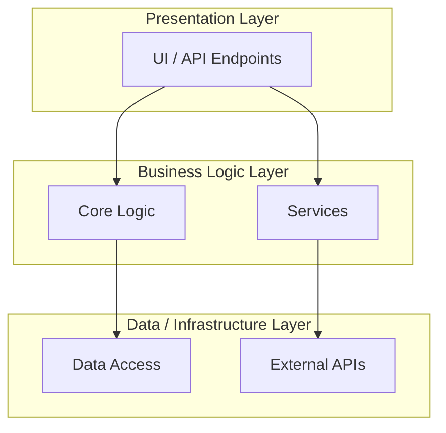

# Architecture Layers

<!-- AI-generated during Project Discovery. Update when layer structure changes. -->

## Layer Responsibilities

| Layer | Components | Responsibility |
|:---|:---|:---|
| **Presentation** | [list] | User interaction, input handling, display |
| **Business Logic** | [list] | Core algorithms, business rules, processing |
| **Data/Infra** | [list] | Persistence, external communication, shared utilities |

## Rules

- Upper layers may depend on lower layers, **not the reverse**.
- Cross-layer communication through defined interfaces only.

---

**Generated:** [YYYY-MM-DD]
**Last Updated:** [YYYY-MM-DD]
