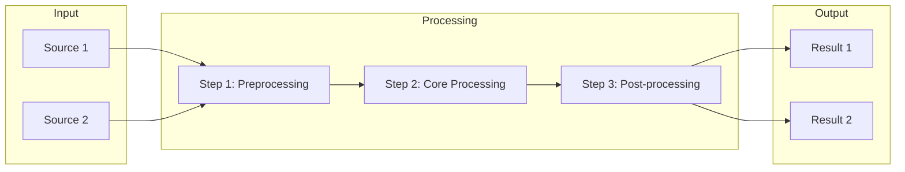

# Data Flow

<!-- AI-generated during Project Discovery. Only create if the project has
     a clear data processing pipeline. Delete this file if not applicable. -->

## Pipeline Stages

| Stage | Input | Output | Notes |
|:---|:---|:---|:---|
| Preprocessing | [raw data] | [cleaned data] | [description] |
| Core Processing | [cleaned data] | [results] | [description] |
| Post-processing | [results] | [final output] | [description] |

---

**Generated:** [YYYY-MM-DD]
**Last Updated:** [YYYY-MM-DD]
