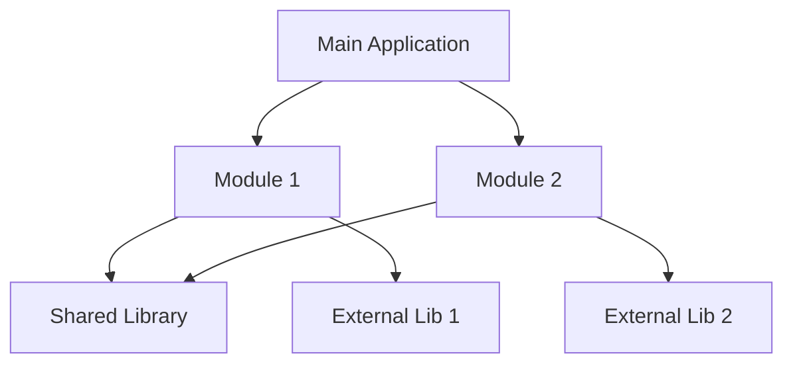

# Dependency Graph

<!-- AI-generated during Project Discovery. Update when dependencies change. -->

## Legend

- **Rectangles**: Project modules (internal)
- **Arrows**: Depends on (A → B means A depends on B)
- **External libs**: Third-party dependencies

---

**Generated:** [YYYY-MM-DD]
**Last Updated:** [YYYY-MM-DD]
